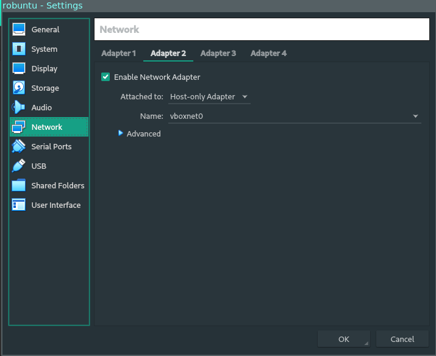

## But

Travailler sur les machines virtuelle de l'école sans utiliser le bureau de la vm.

Explication:

* Lancer la machine virtuelle en mode **Headless**
* Accèss en SSH
* Possibilité de lancer les programmes depuis votre machine physique (ex logisim, Eclipse...)
* Montage des fichiers de la machine virtuelle sur la machine physique

## Parametrage de la machine virtuelle

#### Adresse IP locale

Pour accèder à la machine toujours par la même adresse IP on doit connecter la machine à un réseau virtuel qui est partagé entre notre machine physique et toutes les machines virtuelles.


Avec cette manip, l'adresse IP sur la vm est en DHCP. Elle pourait changer à tout moment. Mais le serveur DHCP de virtualbox ne change normalement pas les adresse de ses clients.

##### Créeation du réseau Host-Only

Dans Virtualbox: File -> Host network manager -> create.

pas besoin de configurer le réseau plus que ça.

##### Connecter la VM au réseau locale

Dans Virtualbox: Séléctionner la machine virtulle -> Settings -> Network -> Adapter 2 -> Enable + Attached to : Host only Adapter



##### Trouver l'adresse IP

* Demarrer la machine virtuelle.
* Ouvrez un terminal
* tapez la commande `ip a` ou  `ifconfig`  
  * Gardez en mémoire l'adresse IP du réseau locale (normalement du style 192.168.56.xxx)
  * (Il est aussi possible de mettre l'adresse IP en statique mais normalement elle ne change pas)

## Sur la machine physique

### Scripts

Ce dossier git contient 3 scripts:

* launchVm
  * Demarre la machine virtuelle
  * Monte le système de fichier de la machine virtuelle sur le système de fichier de la machine physique
  * Ouvre une session SSH vers la machine virtuelle
* connectVm
  * Ouvre une session SSH vers la machine virtuelle
* mountVm
  * Monte le système de fichier de la machine virtuelle sur le système de fichier de la machine physique

Ces scripts on besoin du certain parametres. Ouvrez les scripts et modifiez ces parametres.

### Modifier les scripts pour être executables

pour que les scripts soyent executables il faut faire la commande suivante:

```Bash
chmod +x launchVm
chmod +x connectVm
chmod +x mountVm
```

### Emplacement des scripts

Pour que les scripts soit éxecutable depuis partout, il faut les ajouter dans un dossier qui est dans le PATH:

* Soit copier dans /bin/
* Soit ajouter le dossier dans lequel les scripts s'y trouve dans la variable bash:
  * Exemple si les scripts se trouvent dans /opt/bin
  * Ajouter une ligne dans le fichier ~/.bashrc:
    * `export PATH=$PATH:/opt/bin  `

## Lancement de programme

Dès qu'on est connecté en SSH on peut lancer des programmes.

Voici deux exemples pour la machine virtuelle du REDS 2020:

Lancer la commande dans la fenetre SSH (script launchVm ou connectVm)

#### Lancement d'eclipse

```Bash
/opt/eclipse/eclipse
```

#### Lancement de Logisim

```Bash
java -jar /opt/EDA/Logisim_latest.jar
```

